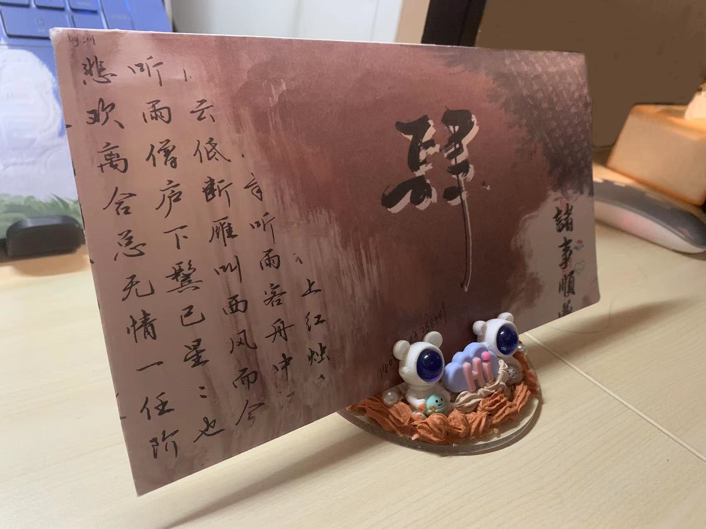

# 笔墨守望

一场书信交流活动，旨在唤醒人们对传统书信的热爱。

---

## 功能分区

- [彩虹小信箱](https://www.popibox.cn/u/iyci6d8j)
- [项目联动](https://mp.weixin.qq.com/s/96vqAp0fz-q4ST-OEvuXhQ)
- [项目风采](#项目风采)

---

## 活动简介
  
参与者可以通过寄送书信，表达对未来的期许与感动。

- 一封书信，联系起一颗心与另一颗心  
- 一字、一情、一句、一心  
- 于信笺中探幽访胜  
- 于字句间沟通心灵  
- 最好新秋时，我们在秋日的暖阳中与你相逢 
- 聊天南地北，问星河浩瀚，谈人间理想

---

## 项目风采

“笔墨守望”项目中的精彩瞬间和温馨片段：

---

## 活动视频

> 视频文件在GitHub上不能直接播放。可以提供视频的链接，或在其他平台上托管视频后提供链接。

---

## 加入我们

[点击此处加入我们](https://mp.weixin.qq.com/s/9uZe7XFILnPmrumPEnPKlg)

---

<footer>
&copy; 2024 笔墨守望 - 让书信温暖传递
</footer>

